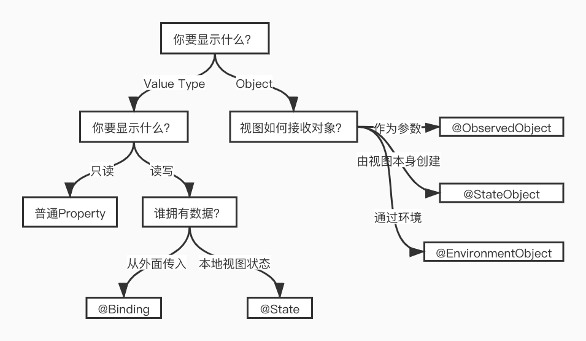

`@ObservedObject`，`@State` 和 `@EnvironmentObject` 有什么区别？
---

在任何现代应用中，状态都是不可避免的，但是使用 `SwiftUI` 时要记住，我们所有的视图只是其状态的简单功能-我们不直接更改视图，而是操纵状态并由其决定结果。



`SwiftUI` 为我们提供了几种在应用程序中存储状态的方法，但是它们有些微的不同，因此，重要的是要了解它们的不同之处，以便正确使用框架。

使用状态的最简单方法是 `@State` 属性包装器，其用法如下：

```swift
struct ContentView: View {
    @State private var tapCount = 0
    var body: some View {
        Button("Tap count: \(tapCount)") {
            tapCount += 1
        }
        .padding(100)
    }
}
```

这会在视图内部创建一个属性，但是它使用 `@State` 属性包装器来请求 `SwiftUI` 管理内存。 这很重要：我们所有的视图都是结构，这意味着它们无法更改，如果我们甚至无法在应用程序中修改整数，那么我们将无能为力。

因此，当我们说 `@State` 做一个属性时，我们将其控制权交给 `SwiftUI`，以便只要视图存在，它就在内存中保持持久。 当状态发生变化时，`SwiftUI` 会自动将视图的最新更改重新加载到视图中，以便它可以反映其新信息。

`@State` 对于属于特定视图且永远不会在该视图之外使用的简单属性非常有用，因此，将这些属性标记为私有很重要，以加强这种状态是专门为当前视图视图使用的而设计的。

## 什么是 `@ObservedObject` ？

对于更复杂的属性；当您要使用的自定义类型可能具有多个属性和方法，或者可能在多个视图之间共享时，通常会使用 `@ObservedObject`。

这与 `@State` 非常相似，不同之处在于，我们现在使用的是外部引用类型，而不是简单的本地属性（例如 `String` 或 `Integer`）。您仍然说的是，视图依赖于会发生变化的数据，但现在您负责管理自己的数据除外-您需要创建该类的实例，创建其自己的属性，等等。

与 `@ObservedObject` 一起使用的任何类型都应符合 `ObservableObject` 协议。在将属性添加到可观察对象时，您可以决定是否对每个属性进行更改都应强制正在刷新正在监视对象的视图。您通常会这样做，但这不是必需的。

观察对象可以通过多种方式通知视图重要数据已更改，但是最简单的方法是使用 `@Published` 属性包装器。如果需要更多控制，也可以从 `Combine` 框架使用自定义发布者，但是实际上这很少见。如果可观察对象使用其数据碰巧有多个视图，则任一选项都会自动通知所有对象。

警告：当您使用自定义发布者宣布您的对象已更改时，这必须在主线程上发生。

## 什么是 `@StateObject`?

`@State` 和 `@ObservedObject` 之间的某个位置是 `@StateObject`。 这是 `@ObservedObject` 的专用版本，其工作方式几乎完全相同：您必须遵守 `ObservableObject` 协议，可以使用 `@Published` 将属性标记为引起更改通知，并且当对象改变时，所有监视 `@StateObject` 的视图都将刷新。

`@StateObject` 和 `@ObservedObject` 之间有一个重要的区别，那就是所有权 – 哪个视图创建了该对象，以及哪个视图仅在监视它。

规则是这样的：无论哪个视图是第一个创建对象的视图，都必须使用 `@StateObject` 来告诉 `SwiftUI` 它是数据的所有者，并负责保持其活动状态。 所有其他视图必须使用 `@ObservedObject`，以告诉 `SwiftUI` 他们想监视对象的更改，但不直接拥有它。

## 什么是 `@EnvironmentObject`?

您已经了解了 `@State` 如何为类型声明简单属性，该类型在更改时会自动刷新视图，以及 `@ObservedObject` 如何为外部类型声明属性，当更改时可能会或不会导致视图刷新。这两个都必须由您的视图设置，但是 `@ObservedObject` 可能与其他视图共享。

还有另一种可以使用的属性包装器，即 `@EnvironmentObject`。这个值可通过应用程序本身提供给视图，它是每个视图都可以读取的共享数据。因此，如果您的应用程序具有一些重要的模型数据，所有视图都需要读取这些数据，则可以将其从一个视图到另一个视图，或者只是将其置于每个视图都可以即时访问它的环境中。

当需要在应用程序中传递大量数据时，`@EnvironmentObject` 可以为您带来极大的便利。由于所有视图都指向同一模型，因此，如果一个视图更改了模型，则所有视图都将立即更新-这样就不会冒着使应用程序的不同部分不同步的风险。

## 总结差异

初始化 `ObservableObject` 时，应使用 `@StateObject` 而不是 `@ObservedObject`。 您的视图可以接收其他视图拥有的对象，例如 `@ObservedObject`或`@EnvironmentObject`，但是数据的所有者应始终使用 `@StateObject` 创建数据对象。

- 将 `@State` 用于属于单个视图的简单属性。 通常应将其标记为私有。
- 将 `@ObservedObject` 用于可能属于多个视图的复杂属性。 大多数情况下，您应该使用引用类型 `@ObservedObject` 。
- 对于您使用的每个可观察对象，请使用 `@StateObject` 一次，无论代码的哪个部分负责创建它。
- 将 `@EnvironmentObject` 用于在应用程序其他位置创建的属性，例如共享数据。

在这四个中，如果不确定从哪个位置开始使用。您会发现 `@ObservedObject` 既最有用，也是最常用的。

