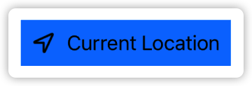

如何使用 `LocationButton` 读取用户的位置？
===

`SwiftUI` 有一个专用的 `LocationButton` 视图，用于显示用于请求用户位置的标准 `UI`。 遗憾的是，它并没有为我们做任何获取位置的工作，但它至少有一个我们可以使用的可识别的用户界面。

为了使用它，您首先需要导入两个框架，一个用于读取位置，一个用于显示按钮：

```swift
import CoreLocation
import CoreLocationUI
```

接下来，您创建某种 `ObservableObject` 能够按需请求用户的位置。 这需要创建一个 `CLLocationManager` 并按需调用其 `requestLocation()` 方法。 然后，您可以将其放在显示位置按钮的 `SwiftUI` 视图中。

所以，你可能会这样写：

```swift
class LocationManager: NSObject, ObservableObject, CLLocationManagerDelegate {
    let manager = CLLocationManager()

    @Published var location: CLLocationCoordinate2D?

    override init() {
        super.init()
        manager.delegate = self
    }

    func requestLocation() {
        manager.requestLocation()
    }

    func locationManager(_ manager: CLLocationManager, didUpdateLocations locations: [CLLocation]) {
        location = locations.first?.coordinate
    }
}

struct ContentView: View {
  @StateObject var locationManager = LocationManager()

  var body: some View {
    VStack {
      if let location = locationManager.location {
          Text("Your location: \(location.latitude), \(location.longitude)")
      }

      if #available(iOS 15.0, *) {
        LocationButton {
            locationManager.requestLocation()
        }
        .frame(height: 44)
        .padding()
        
        LocationButton(.shareMyCurrentLocation) {
            locationManager.requestLocation()
        }
        .frame(height: 44)
        .padding()
      } else {
          // Fallback on earlier versions
      }
    }
  }
}
```



`Apple` 为按钮提供了一些变体设计，通过将其中一个与其初始值设定项一起传递来激活 - 例如，尝试 `LocationButton(.shareMyCurrentLocation)`。

