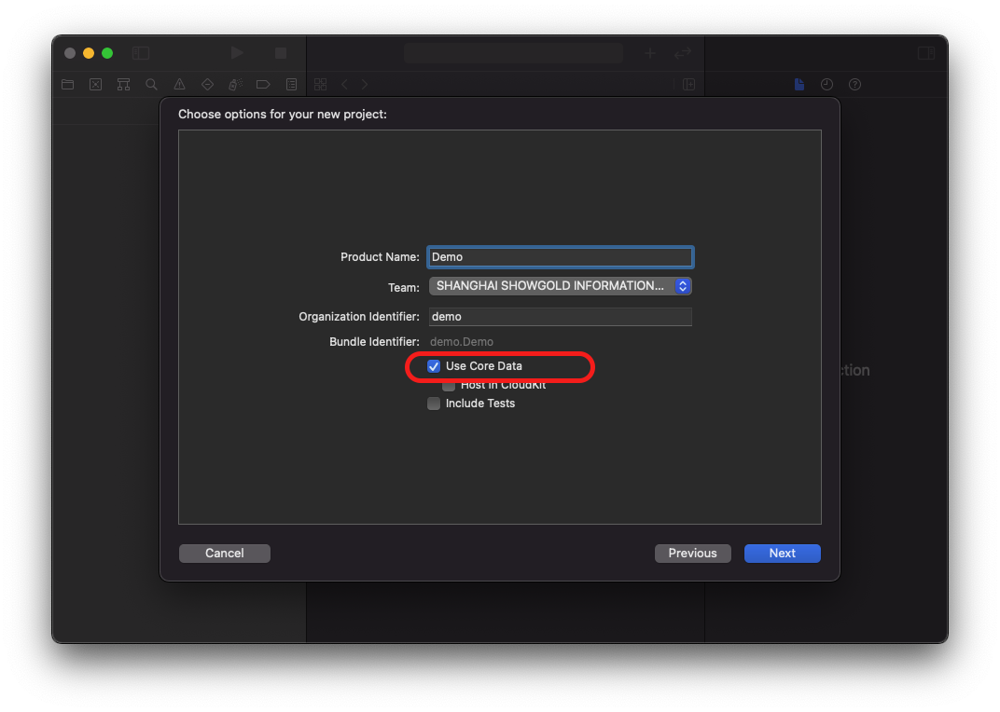
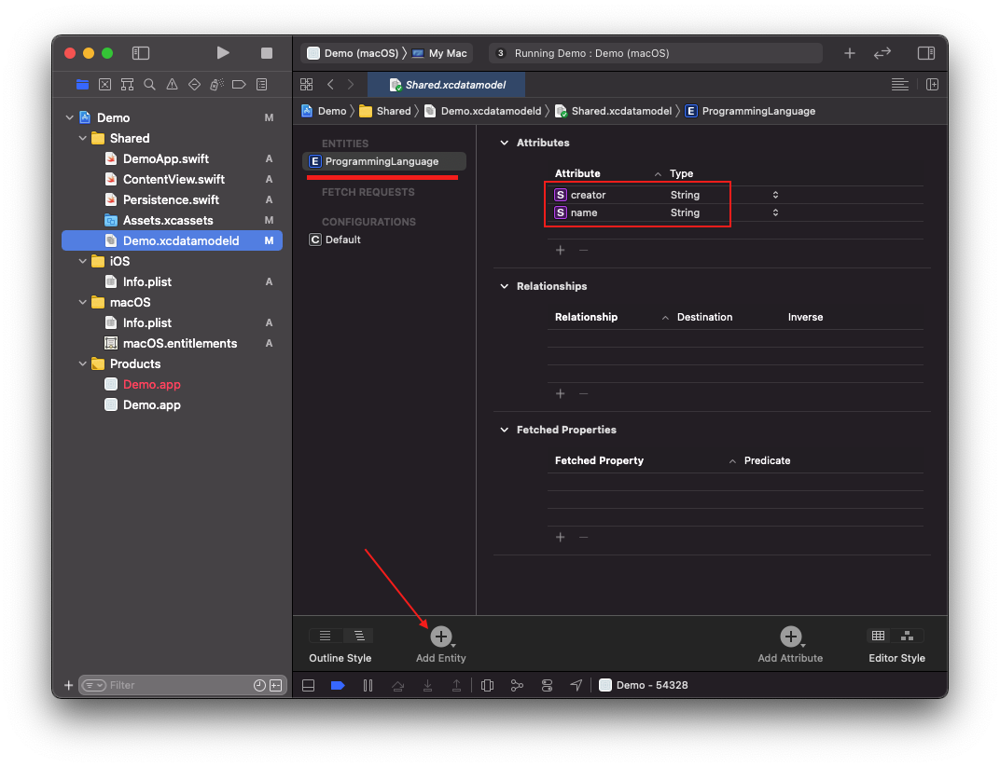

如何配置核心数据以与 `SwiftUI` 一起使用？
===

如果您创建一个新项目并同时检查 `SwiftUI` 和 `Core Data`，则 Xcode 可以很好地帮助您实现有效的配置。具体来说，它：

1. 使用示例配置创建一个空的 `YourProjectName.xcdatamodeld` 模型文件。
2. 添加一个 `Persistence.swift` 文件，该文件将 `Core Data` 整齐地包装在一个位置。
3. 使用 `managedObjectContext` 键将上下文注入到初始内容视图的环境中。
4. 在 `ContentView` 中提供示例代码以创建，读取和删除示例数据。

这为我们提供了在 `SwiftUI` 中使用核心数据提取请求的完整功能。

但是，如果您不使用 `Core Data` 模板，或者只是好奇 `Core Data` 模板为我们做了什么，那么值得简要介绍一下在您的应用中设置支持所需的步骤。我还将为您提供一些示例数据，以便您可以尝试本书的后续章节。

第一步是通过按 `Cmd + N` 创建一个新文件，然后选择 `Core Data` 来创建核心数据模型。该模型的名称很重要，因为它将很快在您的代码中使用。除非您打算使用复杂的 `Core Data` 配置，否则为模型 `Main` 命名是很好的 - 这就是我将在此处使用的名称。建立模型后，就可以继续创建要在应用程序中使用的任何实体。



出于示例目的，我们需要一些一致的数据来使用，以便我为您提供有意义的代码。因此，打开 `xcdatamodeld` 文件并创建一个名为 `ProgrammingLanguage` 的实体，该实体具有两个字符串属性：`name` 和 `creator`。显然，您并不需要完全具有这个实体和属性集合，因此在您进行操作时，只要在头脑上用自己的 `Core Data` 设置替换我的示例即可。



其次，您需要在某个地方加载和管理核心数据配置。 Apple 的模板使用 `Persistence` 单例来完成此任务，这是一个不错的解决方案，因为它足以使 `Core Data` 启动并运行，同时还提供了为 `SwiftUI` 制作预览上下文的功能。

因此，创建一个名为 `Persistence.swift` 的新文件，并提供以下代码：

```swift
struct Persistence {
    // 一个单例供我们的整个应用程序使用
    static let shared = Persistence()

    // 存储核心数据
    let container: NSPersistentContainer

    // SwiftUI预览的测试配置
    static var preview: Persistence = {
        let controller = Persistence(inMemory: true)

        // 创建10种示例编程语言。
        for _ in 0..<10 {
            let language = ProgrammingLanguage(context: controller.container.viewContext)
            language.name = "Example Language 1"
            language.creator = "A. Programmer"
        }

        return controller
    }()

    // 用于加载 Core Data 的初始化程序，可以选择使用内存中的存储区。
    init(inMemory: Bool = false) {
        // 如果您没有为模型 Main 命名，则需要在下面更改此名称。
        container = NSPersistentContainer(name: "Main")

        if inMemory {
            container.persistentStoreDescriptions.first?.url = URL(fileURLWithPath: "/dev/null")
        }

        container.loadPersistentStores { description, error in
            if let error = error {
                // 用代码替换此实现，以适当地处理错误。
                // fatalError() 使应用程序生成崩溃日志并终止。 尽管此功能在开发过程中可能很有用，但您不应在运输应用程序中使用此功能。

                /*
                出现错误的典型原因包括：
                * 父目录不存在，无法创建或不允许写入。
                * 由于设备被锁定时的权限或数据保护，无法访问持久性存储。
                * 设备空间不足。
                * 无法将 store could 迁移到当前模型版本。
                检查错误消息，以确定实际的问题是什么。
                */
                fatalError("Error: \(error.localizedDescription)")
            }
        }
    }
}
```

该代码的内存中存储部分很重要，因为当您配置 `Core Data` 将信息保存到内存而不是磁盘中时，这意味着您所做的所有更改都将在程序结束时被丢弃。

第三，在您的 `Persistence` 类中添加一个 `save()` 方法，以便它检查上下文是否已更改，并在需要时提交更改。

```swift
func save() {
    let context = container.viewContext
    if context.hasChanges {
        do {
            try context.save()
        } catch {
            let nsError = error as NSError
            fatalError("Unresolved error \(nsError), \(nsError.userInfo)")
            // Show some error here
        }
    }
}
```

第四，您需要将 `Core Data` 容器的托管对象上下文注入 `SwiftUI` 环境。

这需要两个较小的步骤，都在 `YourProjectNameApp.swift` 文件中。 首先，为您的应用程序 `struct` 提供一个属性来存储持久性控制器：

```swift
let Persistence = Persistence.shared
```
然后使用 `environment()` 修饰符将新的 `Core Data` 视图上下文附加到环境中的 `managedObjectContext` 键：

```swift
ContentView()
    .environment(\.managedObjectContext, Persistence.container.viewContext)
```

最后一步是可选的，但建议这样做：当您的应用程序移至后台时，您应该调用我们刚才编写的 `save()` 方法，以便 `Core Data` 永久保存您的更改。


在 `SwiftUI` 中，这是通过向我们的应用程序结构添加属性来监视场景阶段来完成的：

```swift
@Environment(\.scenePhase) var scenePhase
```

然后，您可以监视该更改，并每次都调用 `save()`：

```swift
import SwiftUI

@main
struct DemoApp: App {
    let persistenceController = Persistence.shared

    var body: some Scene {
        WindowGroup {
            ContentView()
                .environment(\.managedObjectContext, persistenceController.container.viewContext)
        }
        // .onChange(of: scenePhase) { _ in
        //     persistenceController.save()
        // }
    }
}
```

在 `ContentView` 中提供示例代码以创建，读取并通过按钮添加一条数据

```swift
import SwiftUI
import CoreData

struct ContentView: View {
    @Environment(\.managedObjectContext) private var viewContext

    @FetchRequest(
        sortDescriptors: [NSSortDescriptor(keyPath: \ProgrammingLanguage.name, ascending: true)],
        animation: .default)
    private var items: FetchedResults<ProgrammingLanguage>

    var body: some View {
        NavigationView {
            List {
                ForEach(items) { item in
                    if (item.name != nil) {
                        Text("Item at \(item.name!)")
                    }
                }
            }
            .toolbar {
                Button(action: addItem) {
                    Label("Add Item", systemImage: "plus")
                }
            }
            
        }
    }
    
    private func addItem() {
        let language = ProgrammingLanguage(context: viewContext)
        language.name = "Example Language 1"
        language.creator = "A. Programmer"

        do {
            try viewContext.save()
        } catch {
            let nsError = error as NSError
            fatalError("Unresolved error \(nsError), \(nsError.userInfo)")
        }
        
    }

}

struct ContentView_Previews: PreviewProvider {
    static var previews: some View {
        ContentView().environment(\.managedObjectContext, Persistence.preview.container.viewContext)
    }
}
```

完毕！

重要提示：这些说明很重要！

为避免混淆，我想重复一下，以上说明对于为 SwiftUI 设置有用的 `Core Data` 环境非常重要。 随后的所有 `Core Data` 章节均假定您已遵循上述说明。