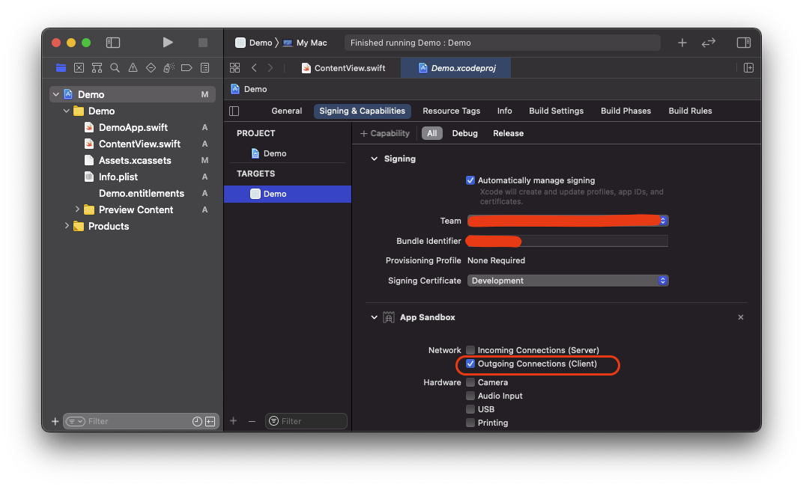
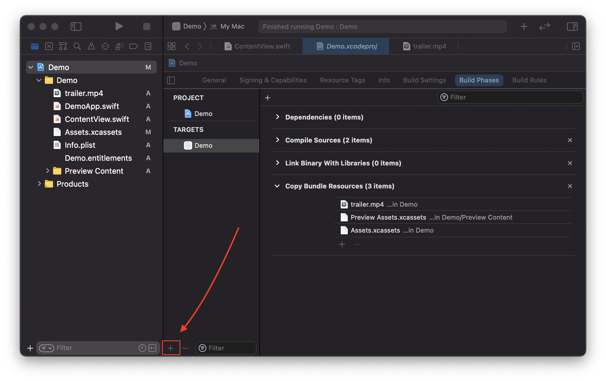
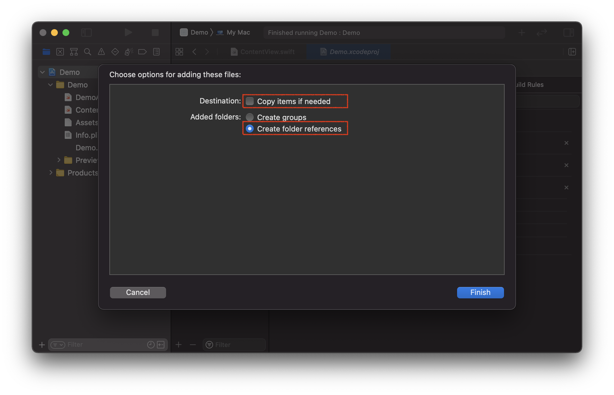

如何使用 `VideoPlayer` 播放电影？
===

SwiftUI 的 `VideoPlayer` 视图使我们可以从本地或远程的任何URL播放电影。 它来自 `AVKit` 框架，因此在尝试之前，请确保并添加导入 `AVKit`。

例如，如果您的应用程序包中包含 `video.mp4` 并想播放，请使用以下命令：

```swift
VideoPlayer(player: AVPlayer(url:  Bundle.main.url(forResource: "video", withExtension: "mp4")!))
    .frame(height: 400)
```

提醒：您需要将导入 `AVKit` 添加到 `Swift` 文件中才能使用它。

如果要播放远程视频，请改用其远程URL：

```swift
VideoPlayer(player: AVPlayer(url:  URL(string: "https://media.w3.org/2010/05/sintel/trailer.mp4")!))
    .frame(height: 400)
```

如果需要，可以向 `VideoPlayer` 初始化程序提供第二个参数，该参数添加要在视频上绘制的内容。 此内容将绘制在系统视频控件下方，但可以响应那些控件未捕获的任何事件。

例如，这会将文本“水印(Watermark)”放置在视频区域的顶部：

```swift
VideoPlayer(player: AVPlayer(url:  URL(string: "https://media.w3.org/2010/05/sintel/trailer.mp4")!)) {
    VStack {
        Text("Watermark")
            .foregroundColor(.black)
            .background(Color.white.opacity(0.7))
        Spacer()
    }
    .frame(width: 400, height: 300)
}
```

⚠️ 注意：应用地址要使用 `https` 如果使用 `http` 需要启用它，同时设置 传出连接（客户端）`outgoing connections(client)`



⚠️ 注意：本地添加资源的方式



