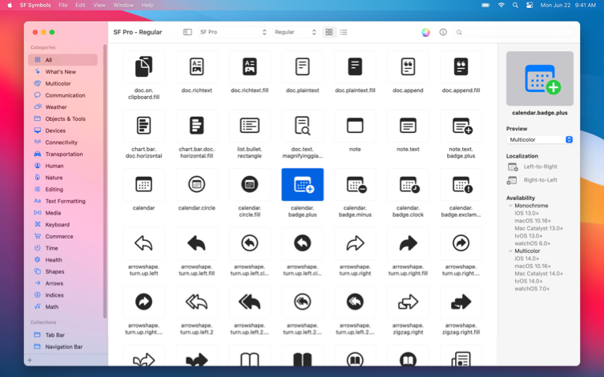

如何使用SF符号渲染图像？
----

`SwiftUI` 的 `Image` 视图使我们可以从 [`SF Symbols`](https://developer.apple.com/sf-symbols/) 中加载任何 [`2400+`](https://developer.apple.com/design/human-interface-guidelines/sf-symbols/overview/) 图标，其中许多图标也可以使用多色。

要从 Apple 的 [`SF Symbols`](https://developer.apple.com/design/human-interface-guidelines/sf-symbols/overview/) 集中加载图标，请使用 `Image(systemName:)`初始化程序，并传入要加载的图标字符串，如下所示：

```swift
Image(systemName: "cloud.heavyrain.fill")
```

您获得的图像是可缩放的且可着色的，这意味着您可以要求 `SwiftUI` 放大图像以匹配其随附的任何“动态类型”文本样式（如果有）：

```swift
Image(systemName: "cloud.heavyrain.fill")
    .font(.largeTitle)
```

而且这还意味着您可以使用与您已经看到的相同的 `frontantColor()` 修饰符为图像着色：

```swift
Image(systemName: "cloud.heavyrain.fill")
    .font(.largeTitle)
    .foregroundColor(.red)
```

如果您使用的图像包含色彩元素，则可以使用 `.renderingMode().original)` 激活多色模式，如下所示：

```swift
Image(systemName: "cloud.sun.rain.fill")
    .renderingMode(.original)
    .font(.largeTitle)
    .padding()
    .background(Color.black)
    .clipShape(Circle())
```

您可以选择将 `foregroundColor()` 修改器应用于多色 SF符号，这将使部分符号重新着色。 例如，这将使图标的一部分变为蓝色，而部分变为绿色：

```swift
Image(systemName: "person.crop.circle.fill.badge.plus")
    .renderingMode(.original)
    .foregroundColor(.blue)
    .font(.largeTitle)
```

通过 Apple 提供的应用 [SF Symbols 2](https://developer.apple.com/sf-symbols/) 查看 [`SF Symbols`](https://developer.apple.com/sf-symbols/) 所有的图标名称。

