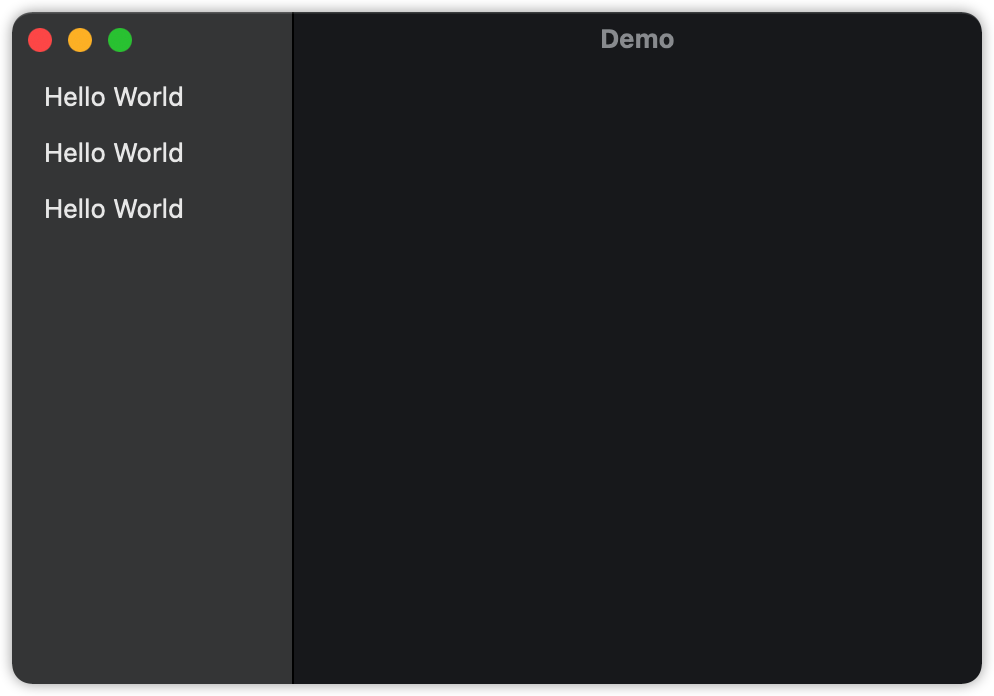

使用列表构建菜单
===

我们将从简单开始，然后逐步发展。 在此过程中，将开始看到 `SwiftUI` 使某些事情变得容易的事情，以及有些困难的事情。

在 `ContentView.swift` 中是一个基本结构，代表我们应用程序中唯一的屏幕：`ContentView`。 看起来像这样：

```swift
struct ContentView: View {
  var body: some View {
    Text("Hello World")
      .padding()
  }
}
```

不是很多代码，但是已经告诉了我们很多：

1. 视图是 `SwiftUI` 中的结构。这不是必需的，但强烈建议您这样做。
2. 所有视图都必须符合 `View` 协议。
3. 该协议需要一个称为 `body` 的计算属性，该属性包含视图的实际布局。
4. 它返回一些 `View`，这是一种Swift功能，称为不透明的返回类型-表示 “一种特定的视图，但我们并不在乎哪个视图。”
5. 在我们的内容视图内部是一个基本的UI块，称为 `Text`。它用于在 `SwiftUI` 中表示文本字符串，可以直接作为标签表示，也可以间接表示为导航栏，按钮等内部的文本。
6. 文本上有一个 `padding()` 方法调用，它告诉SwiftUI我们在该视图周围需要一些额外的空间。 在SwiftUI中，我们称这些修饰符是因为它们修改了文本视图的外观或行为方式。

您还应该在 `Xcode` 的右侧看到预览窗格。输入代码时会更新，这是一种在工作时查看所做更改的好方法。 如果您没有在右侧看到预览窗格，请到 `Editor` 菜单，然后选择 `Canvas`。

如果 `Xcode` 的预览区域停止（这会经常发生），则可以按 <kbd>⌘</kbd> + <kbd>⌥</kbd> + <kbd>p</kbd> 使其恢复显示布局。


⚠️ 这真的很重要，因此我要重复一遍：按下 <kbd>⌘</kbd> + <kbd>⌥</kbd> + <kbd>p</kbd> 将更新您的 `SwiftUI` 预览。


`Xcode` 为我们创建的基本内容视图是一个单独的文本视图，上面写着 `Hello World`，并带有一些填充-多余的边距阻止了我们添加的任何其他视图之间的距离过近。 在我们的应用程序中，这实际上将向我们显示菜单中的项目列表，因此我们将改用列表视图。

将 [下面代码在工程中](https://github.com/jaywcjlove/swiftui-example/blob/ce7d93191e80cf8214ce04d917827fc36bb1091b/example/demo2/Demo/Demo/ContentView.swift#L12-L16) 替换当前的文本视图，：

```swift
List {
  Text("Hello World")
  Text("Hello World")
  Text("Hello World")
}
```

使用 `NavigationView` 呈现视图堆栈的视图，这些视图表示导航层次结构中的可见路径。

```swift
NavigationView {
  List {
    Text("Hello World")
    Text("Hello World")
    Text("Hello World")
  }
}
```

通过 `.listStyle(SidebarListStyle())` 设置导航菜单列表透明磨砂玻璃效果。


```swift
NavigationView {
  List {
    Text("Hello World")
    Text("Hello World")
    Text("Hello World")
  }
  .listStyle(SidebarListStyle())
}
```

