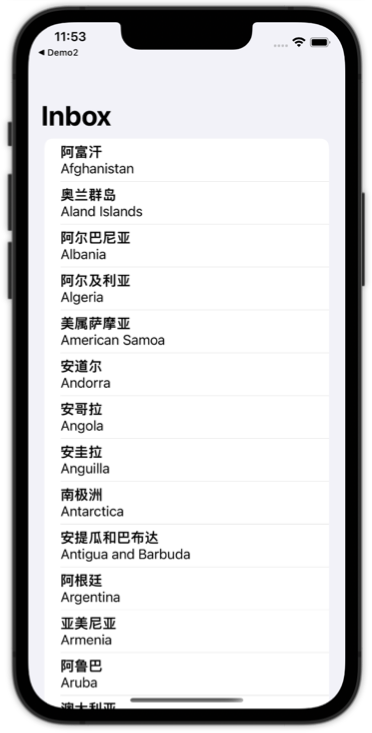

显示视图时如何运行异步任务？
===


`SwiftUI` 的 `task()` 修饰符是 `onAppear()` 的更强大版本，允许我们在显示视图时立即开始异步工作。 更好的是，如果视图尚未完成，任务将在视图被销毁时自动取消。

由于任务是异步执行的，因此这是为您的视图获取一些初始网络数据的好地方。 例如，如果我们想从服务器获取消息列表，将其解码为 `Message` 结构数组，然后将其显示在列表中，我们可能会这样写：

```swift
struct Message: Decodable, Identifiable {
  let id: Int
  let cnname: String
  let name: String
  let fullname: String
  let alpha2: String
  let alpha3: String
  let numeric: Int
}

struct ContentView: View {
  @State private var messages = [Message]()

  var body: some View {
    if #available(iOS 15.0, *) {
      NavigationView {
        List(messages) { message in
            VStack(alignment: .leading) {
                Text(message.cnname)
                    .font(.headline)
                Text(message.name)
            }
        }
        .navigationTitle("Inbox")
      }
      .task {
          do {
              let url = URL(string: "https://unpkg.com/province-city-china@8.0.0/dist/country.json")!
              let (data, _) = try await URLSession.shared.data(from: url)
              messages = try JSONDecoder().decode([Message].self, from: data)
          } catch {
              messages = []
          }
      }
    } else {
        // Fallback on earlier versions
    }
  }
}
```

<!--rehype:style=max-width:320px-->

您可以将 `task()` 修饰符附加到层次结构中的任何视图，即使是由于导航推送而呈现的视图——它只会在视图显示时才真正开始工作。

为了证明这一点，我们可以创建一个简单的网站源代码查看器，用户可以在其中选择要检查的网站：

```swift
struct ContentView: View {
  let sites = ["Apple.com", "wangchujiang.com", "Swift.org"]

  var body: some View {
    NavigationView {
      List(sites, id: \.self) { site in
        NavigationLink(site) {
            SourceViewer(site: site)
        }
      }
      .navigationTitle("View Source")
    }
  }
}

struct SourceViewer: View {
  let site: String
  @State private var sourceCode = "Loading…"

  var body: some View {
    if #available(iOS 15.0, *) {
      ScrollView {
          Text(sourceCode)
              .font(.system(.body, design: .monospaced))
      }
      .task {
          guard let url = URL(string: "https://\(site)") else {
              return
          }
          
          do {
              let (data, _) = try await URLSession.shared.data(from: url)
              sourceCode = String(decoding: data, as: UTF8.self).trimmingCharacters(in: .whitespacesAndNewlines)
          } catch {
              sourceCode = "Failed to fetch site."
          }
      }
    } else {
      EmptyView()
      // Fallback on earlier versions
    }
  }
}
```

`task()` 和 `onAppear()` 都能够在您查看显示时运行同步函数，因此除了个人品味之外，没有特别的理由选择其中一个 - 将 `onAppear()` 和 `onDisappear()` 放在一起是一个很好的平衡 .

提示：默认情况下，使用 `task()` 修饰符创建的 `Swift` 任务将以最高的可用优先级运行，但如果您知道工作不太重要，则可以将自定义优先级传递给修饰符。