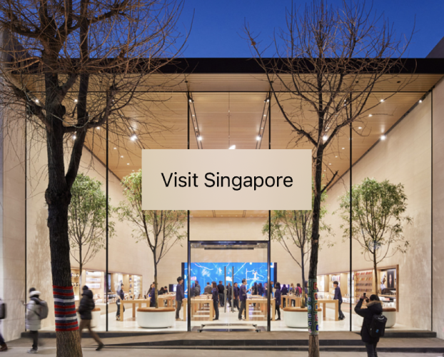

如何添加视觉效果模糊？
===


`SwiftUI` 有一个非常简单的 `UIVisualEffectView` 等效项，它结合了 `ZStack`、`background()` 修饰符和一系列内置材料。

例如，这会在图像上放置一些文本，对文本应用标准模糊效果：

```swift
ZStack {
    Image("singapore")

    Text("Visit Singapore")
        .padding()
        .background(.thinMaterial)
}
```

<!--rehype:style=max-width:320px-->

您可以使用多种材质类型中的一种来调整材质的“厚度”——背景内容有多少透过。 从最薄到最厚，它们是：

- `.ultraThinMaterial`
- `.thinMaterial`
- `.regularMaterial`
- `.thickMaterial`
- `.ultraThickMaterial`

如果您使用辅助前景色，`SwiftUI` 会自动调整文本颜色，使其具有鲜明的效果并能从背景中脱颖而出：

```swift
ZStack {
    Image("singapore")

    Text("Visit Singapore")
        .foregroundColor(.secondary)
        .padding()
        .background(.ultraThinMaterial)
}
```

<!--rehype:style=max-width:320px-->