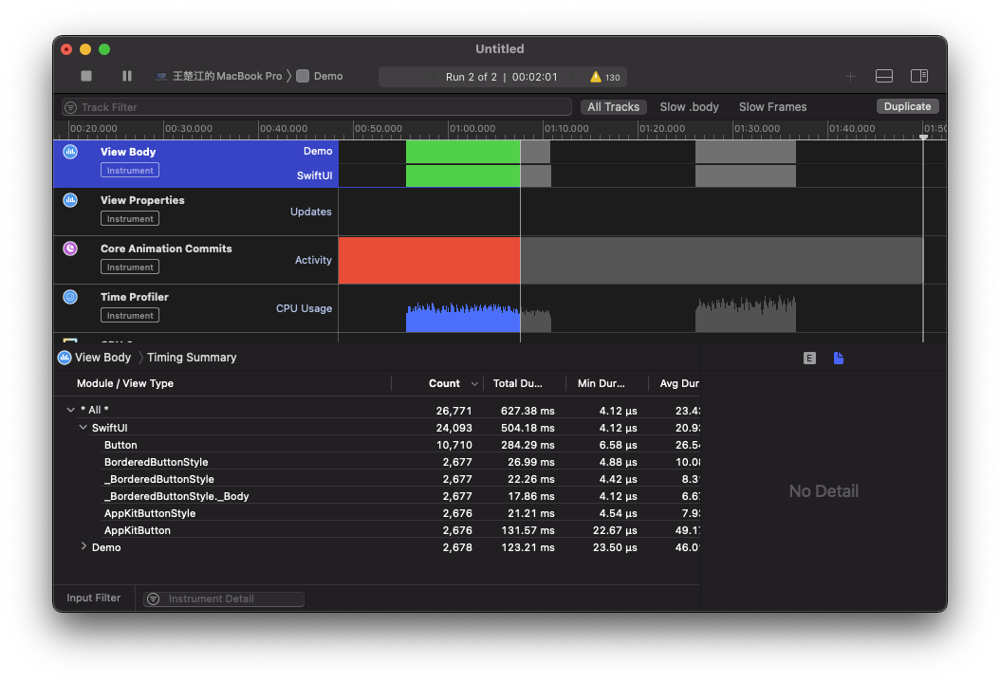
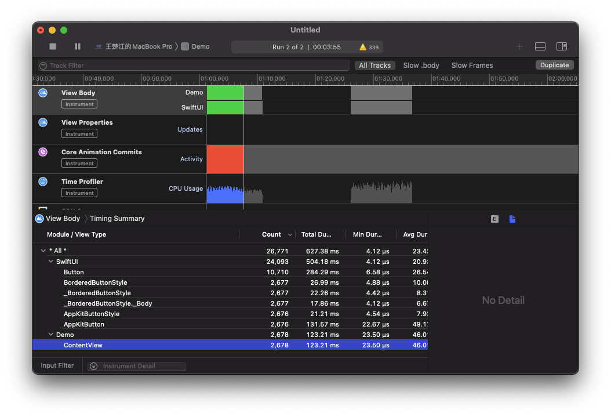
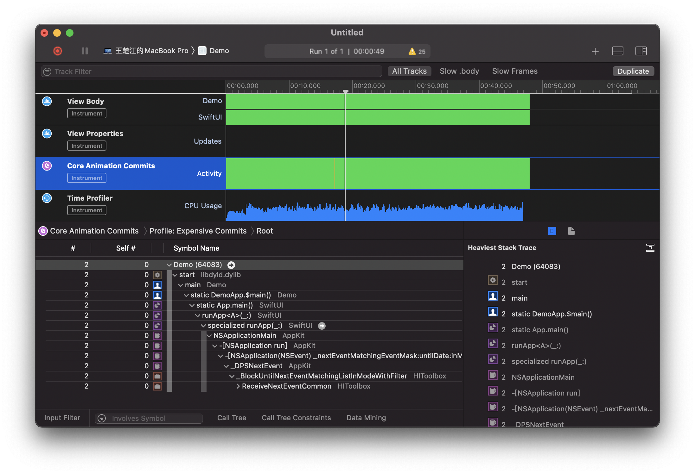
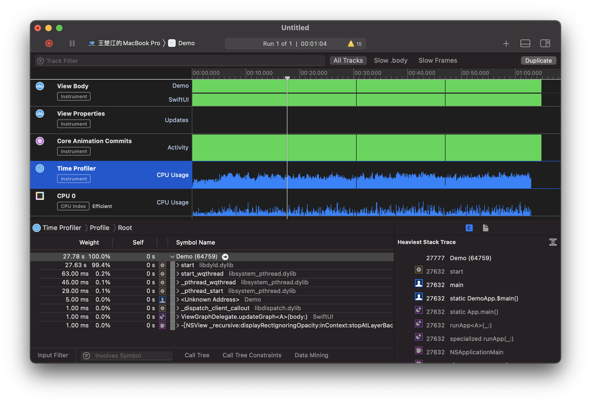

如何使用 `Instruments` 来配置您的 SwiftUI 代码并识 `identify` 布局？
---

Xcode 的仪器工具有一个梦幻般的 `SwiftUI` 的分析，允许我们识别次删除的频率，计算身体的速度较慢，甚至我们的国家如何随时间变化。

首先，我们需要一些能够提供有趣的结果，我们可以在乐器中看待。 因此，此代码创建一个计时器，触发每 `0.01`秒，并具有显示随机 `UUID`和按钮的正文视图，该按钮增加其显示它显示的值：

```swift
import Combine
import SwiftUI

class FrequentUpdater: ObservableObject {
    let objectWillChange = PassthroughSubject<Void, Never>()
    var timer: Timer?

    init() {
        timer = Timer.scheduledTimer(
            withTimeInterval: 0.01,
            repeats: true
        ) { _ in
            self.objectWillChange.send()
        }
    }
}

struct ContentView: View {
    @ObservedObject var updater = FrequentUpdater()
    @State private var tapCount = 0

    var body: some View {
        VStack {
            Text("\(UUID().uuidString)")

            Button("Tap count: \(tapCount)") {
                tapCount += 1
            }
        }
    }
}
```

如果您在模拟器中运行该代码，则会看到它不断重绘，因为它具有始终更改的值。

注意：这是一个专门设计的压力测试，使 `SwiftUI` 进行大量工作，以便仪器显示我们有趣的数据 - 您不想在实际应用中使用上面的代码。

## 检测我们的代码

现在按 `Cmd+I` 通过仪器运行代码，然后选择 `SwiftUI` 仪器。 出现时，按 `Record` 按钮使其启动应用程序并开始观看。 现在让它在点击按钮10左右时运行几秒钟，然后在仪器中按停止 - 我们有足够的数据来使用。

默认情况下，`SwiftUI`仪器告诉我们各种各样的事情：

1. 在此期间创建了多少次观看以及创建它们需要多长时间（“查看body View Body”）
2. 观点的属性是什么以及它们如何随时间改变（“查看属性 View Properties”）
3. 发生了多少核心动画（“核心动画提交 Core Animation Commits”）
4. 正是每个函数调用所花费的时间（“时间剖析器 Time Profiler”）

这些仪器中的每一个都可以帮助您诊断和解决您的SWIFTUI应用程序中的性能问题，因此值得花时间尝试。

对于我们的小压力测试沙箱，您将看到视图身体，查看属性和核心动画提交的固体墙壁，这是一个直接的红旗。 它告诉我们，不仅是Swifui不得不经常重新创建观点，但我们的房产经常更改，因此核心动画必须加班以便跟上。



## 监测 body 调用

如果您选择 `View Body` 轨迹 - 这是仪器列表的第一行-您应该能够看到 Instruments 将结果分解为 SwiftUI 和您的项目，其中前者是原始类型，例如文本视图和按钮，后者包含您的自定义视图类型。在我们的情况下，这意味着 `ContentView` 应出现在自定义视图中，因为这就是我们的视图名称。

现在，您将在这里看不到的是代码到 `SwiftUI` 视图的完美一对一映射，因为 `SwiftUI` 会主动折叠其视图层次结构以减少工作量。因此，不要期望在代码中看到任何 `VStack` 创建内容-该应用程序实际上是免费的。

在此屏幕上，重要的数字是“计数”和“平均持续时间” –每件事创建了多少次，花费了多长时间。由于这是一个压力测试，您应该会看到Count的数字很高，但是我们的布局微不足道，因此Avg Duration可能只有几十微秒。




## 跟踪状态变化 Tracking state changes

接下来，选择`View Properties` 轨道，它是仪器列表中的第二行。这将显示所有视图的所有属性，包括它们的当前值和所有先前的值。

我们的示例应用程序具有一个按钮，可在点击时通过将一个数字添加一个按钮来更改其标签，并且该按钮在此工具中就可见了-查找视图类型 `ContentView` 和属性类型 `State<Int>`。

遗憾的是，Instruments无法（尚未？）向我们显示确切的属性名称，如果您要跟踪几条整数状态，则可能会更加令人困惑。但是，它确实有一个不同的技巧：在记录窗口的顶部是一个标记当前视图位置的箭头，如果在周围拖动它，您将确切地看到应用程序状态随时间的变化–每次您轻按按钮，您将看到状态整数加1，并且您可以向前和向后滚动以查看它的发生。

这可以释放巨大的力量，因为它可以让我们直接查看状态更改何时导致缓慢的重绘或其他工作-就像是在时光机中，您可以在其运行期间随时检查应用程序的确切状态。


## 识别慢绘制 Identifying slow draws

尽管 `SwiftUI` 可以直接使用 `Metal` 来提高性能，但大多数情况下，它更喜欢使用 `Core Animation` 进行渲染。 这意味着我们会自动从 `Instruments` 获得内置的 `Core Animation` 分析工具，包括检测昂贵提交的功能。

当将多个更改放到一个组中（称为事务）时，`Core Animation`效果最佳。 我们有效地在一个事务中堆叠了一部分工作，然后要求 `CA` 继续进行工作-称为提交事务。

因此，当 `Instruments` 向我们展示昂贵的 `Core Animation` 提交时，真正向我们展示的是 `SwiftUI` 由于更新而被迫在屏幕上重新绘制像素的次数。 从理论上讲，这仅应在应用程序的实际状态导致不同的视图层次结构时发生，因为 `SwiftUI` 应该能够将 `body` 属性的新输出与先前的输出进行比较。



## 寻找慢速功能调用 Looking for slow function calls

最后一个重要的轨道是最后一个轨道，即 `Time Profiler`，它向我们显示了在代码的每个部分中花费了多少时间。 该工具的工作方式与 `Instruments` 中的常规时间分析器相同，但是如果您以前没有尝试过，则至少需要了解以下内容：

1. 右侧的扩展详细信息窗口默认显示最重的堆栈跟踪，这是运行时间最长的一段代码。明亮的代码（白色或黑色，具体取决于您的macOS配色方案）是您编写的代码；暗淡的代码（灰色）是系统库代码。
2. 在左侧，您可以看到所有创建的线程，以及显示指示器，可让您深入了解它们调用的功能以及这些功能调用的功能，等等。大多数工作将在“开始”内部进行。
3. 为避免混乱，您可能需要单击底部的“调用树”按钮，然后选择“隐藏系统库”。这只会显示您编写的代码，但是，如果您的问题是您严重使用了系统库，则可能无济于事。
4. 要直接了解特定细节，您还可以单击“调用树”，然后选择“反转调用树”来翻转内容，以便在顶部显示叶子功能（位于树末端的功能），并且现在可以使用公开指示器来进行向下钻取。 （向上钻取？）调用它们的功能。

尽管时间分析器对于识别性能问题非常有用，但是通常只要查看最重的堆栈跟踪就会突出显示最大的问题。



## 最后提示 Last tips

在冲销概要分析自己的代码之前，需要注意以下几点：

1. 在检查应用程序性能的一小部分时，应在相关范围内单击并拖动，以便仅查看该应用程序那部分的统计信息。这使您可以专注于特定操作的性能，例如响应按钮按下。
2. 即使您在 `Instruments` 中看到了纯色条，它们也只能从远处观看-您可以通过按住 `Cmd` 并按 `-` 和 `+` 进行缩放以查看更多详细信息
3. 为了获得最准确的数字，请始终在真实设备上进行剖析。
4. 如果要由于对代码进行概要分析而进行更改，请始终一次进行一次更改。如果您进行两项更改，则有可能一种将性能提高20％，另一项将性能降低10％，但是一起进行意味着您可能认为它们总体上将性能提高了10％。
5. Instruments在发布模式下运行您的代码，该模式可实现Swift的所有优化。这也会影响您添加到代码中的所有调试标志，因此请务必小心。