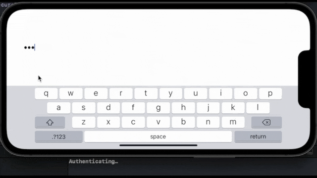

当用户提交 `TextField` 时如何采取事件？
===


SwiftUI 有一个 `onSubmit()` 修饰符，可以附加到层次结构中的任何视图，并在用户完成将文本输入到 `TextField` 或 `SecureField` 时运行您选择的函数。

例如，我们可以要求用户输入他们的密码，然后在他们按下回车键时运行一些代码：

```swift
struct ContentView: View {
  @State private var password = ""

  var body: some View {
    if #available(iOS 15.0, *) {
      SecureField("Password", text: $password)
        .onSubmit {
            print("Authenticating…")
        }
    } else {
        // Fallback on earlier versions
    }
  }
}
```

<!--rehype:style=max-width:320px-->

对于这样的简单示例，`TextField` 和 `SecureField` 都接受专用的 `onCommit` 参数，我们可以在其中直接将我们的函数附加到它们。 但是，使用 `onSubmit()` 的优势在于它可以捕获在其上下文中提交的所有文本值，这使得填写表单更加容易：

```swift
struct ContentView: View {
  @State private var username = ""
  @State private var password = ""

  var body: some View {
    Form {
      TextField("Username", text: $username)
      SecureField("Password", text: $password)
    }
    .onSubmit {
      guard username.isEmpty == false && password.isEmpty == false else { return }
      print("Authenticating…")
    }
  }
}
```